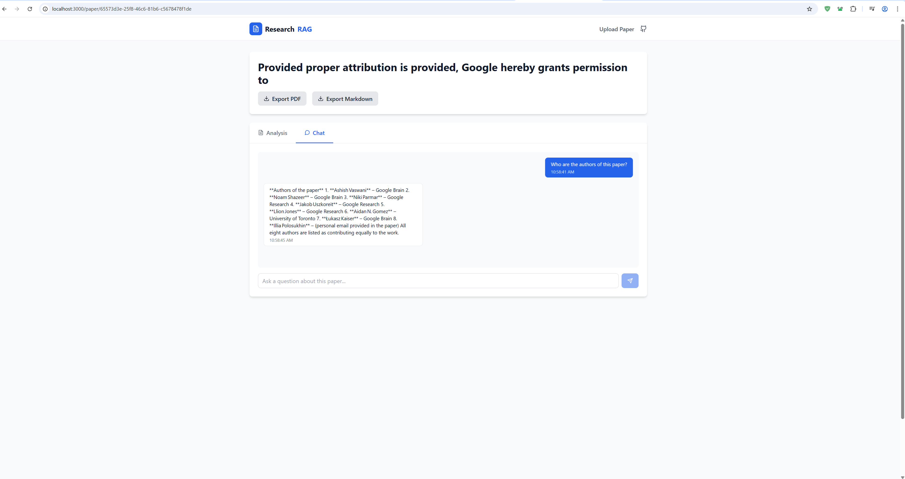
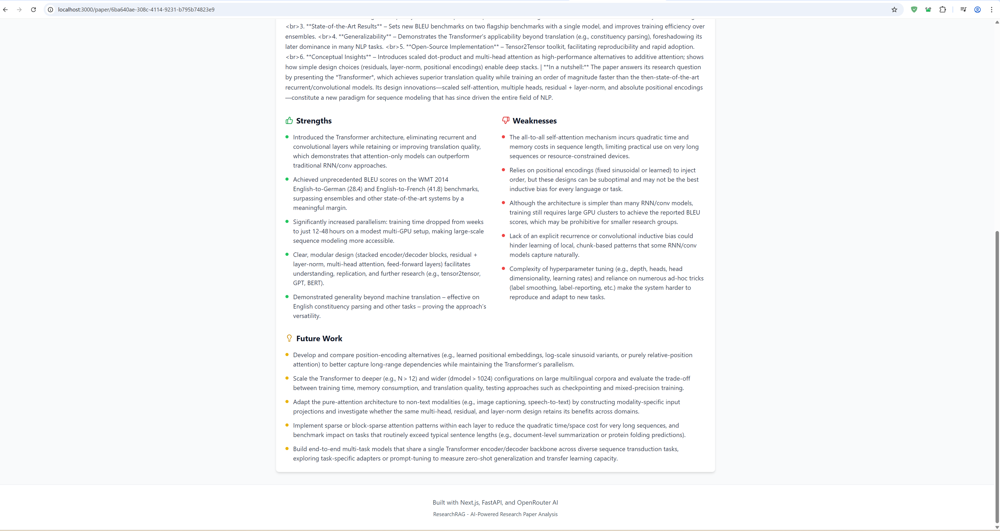
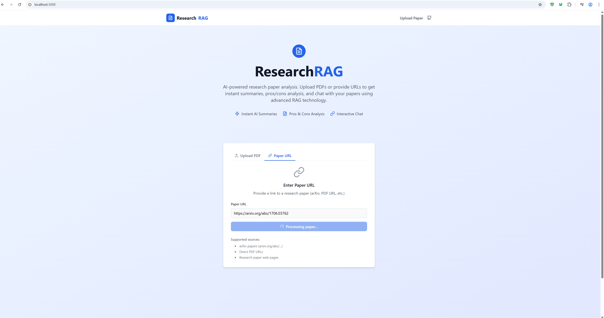
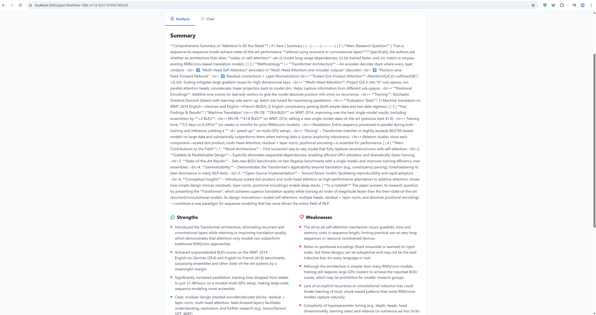
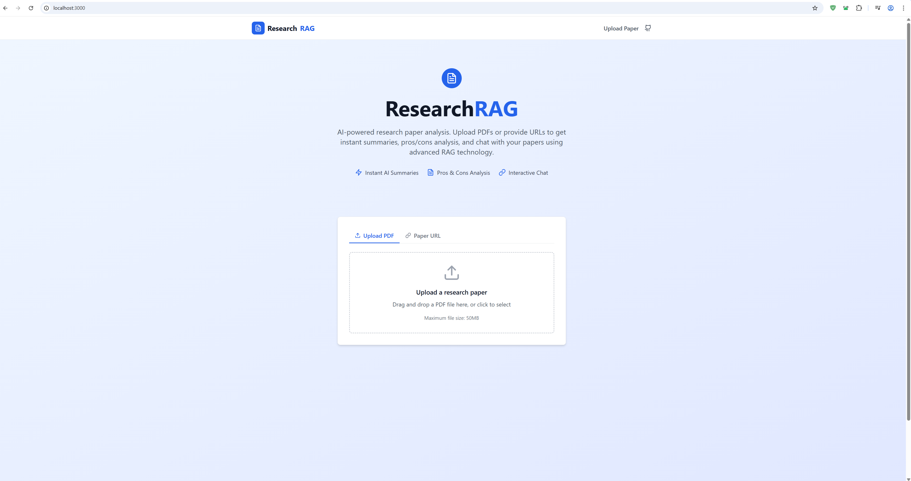

# ResearchRAG

<div align="center">
  
  
  
  
</div>

<p align="center">
  <strong>AI-powered research paper analysis tool using advanced RAG technology</strong>
</p>

<p align="center">
  Upload PDFs or provide URLs to get instant summaries, pros/cons analysis, and interactive chat with your research papers using cutting-edge AI.
</p>

## 🚀 Features

- **📄 Multiple Input Methods**: Upload PDF files directly or provide arXiv URLs
- **🤖 AI-Powered Analysis**: Comprehensive summaries with strengths/weaknesses breakdown
- **💬 Interactive Chat**: Ask questions and get detailed responses about paper content
- **📊 Export Options**: Download results as PDF or Markdown
- **⚡ Fast Processing**: Efficient document processing with FAISS vector storage
- **🆓 Free AI Models**: Uses only free OpenRouter models for cost-effective analysis

## 📸 Application Screenshots

### 🏠 Home Page - Clean Interface
The main landing page offers multiple ways to upload research papers with an intuitive, modern design.



### 🔗 URL Input - arXiv Integration
Seamlessly input arXiv URLs for automatic paper retrieval and processing.



### 🧠 AI Analysis - Comprehensive Insights
Get detailed analysis including summaries, strengths, weaknesses, and future research directions.



### 💬 Interactive Chat - Deep Conversations
Chat with your research papers to explore concepts, ask questions, and gain deeper insights.



### 📊 Additional Features
Advanced functionality and detailed paper analysis capabilities.



## 🛠️ Tech Stack

### Backend
- **FastAPI** - High-performance Python web framework
- **FAISS** - Efficient similarity search and clustering
- **OpenRouter API** - Access to multiple AI models
- **PyMuPDF & PyPDF2** - PDF processing and text extraction

### Frontend
- **React** - Modern UI library with hooks
- **Tailwind CSS** - Utility-first CSS framework
- **Vite** - Fast build tool and development server

### AI & Processing
- **RAG (Retrieval-Augmented Generation)** - Advanced AI architecture
- **Vector Embeddings** - Semantic search capabilities
- **Text Chunking** - Intelligent document segmentation

## ⚙️ Quick Start

### Prerequisites
- **Python 3.8+**
- **Node.js 16+** (for frontend)
- **OpenRouter API Key** ([Get one free](https://openrouter.ai/))

### 1. Install Dependencies
```bash
# Backend dependencies
pip install fastapi uvicorn python-multipart PyMuPDF PyPDF2 faiss-cpu numpy openai requests python-dotenv pydantic aiofiles reportlab markdown

# Frontend dependencies (optional)
cd frontend && npm install
```

### 2. Configure Environment
Create `.env` file in the root directory:
```env
OPENROUTER_API_KEY=your_openrouter_api_key_here
```

### 3. Run the Application
```bash
# Start backend server
python run.py

# Start frontend (in another terminal)
cd frontend && npm run dev
```

### 4. Access the Application
- **Frontend UI**: http://localhost:5173
- **Backend API**: http://localhost:8000
- **API Documentation**: http://localhost:8000/docs

## 📡 API Endpoints

| Method | Endpoint | Description |
|--------|----------|-------------|
| `POST` | `/upload-paper` | Upload PDF file or provide URL |
| `GET` | `/summary/{paper_id}` | Get comprehensive paper analysis |
| `POST` | `/chat/{paper_id}` | Interactive chat with paper content |
| `GET` | `/export/{paper_id}/{format}` | Export summary (PDF/Markdown) |

## 📖 Usage Guide

### 1. Upload Research Papers
- **File Upload**: Drag and drop PDF files or click to browse
- **URL Input**: Provide arXiv URLs for automatic retrieval
- **Supported Formats**: PDF files up to 50MB

### 2. Get AI Analysis
- **Summary**: Comprehensive overview of the research
- **Strengths**: Key contributions and advantages
- **Weaknesses**: Limitations and areas for improvement
- **Future Work**: Suggested research directions

### 3. Interactive Chat
- Ask specific questions about methodology
- Request clarifications on complex concepts
- Explore related research areas
- Get detailed explanations of findings

### 4. Export Results
- **PDF Export**: Professional formatted reports
- **Markdown Export**: Easy-to-edit text format
- **Share**: Copy links to share analyses

## 🔧 Example API Usage

```bash
# Upload a research paper
curl -X POST "http://localhost:8000/upload-paper" \
  -F "file=@research_paper.pdf"

# Get analysis summary
curl "http://localhost:8000/summary/{paper_id}"

# Chat with the paper
curl -X POST "http://localhost:8000/chat/{paper_id}" \
  -H "Content-Type: application/json" \
  -d '{"query": "What is the main contribution of this research?"}'

# Export summary as PDF
curl "http://localhost:8000/export/{paper_id}/pdf" \
  --output summary.pdf
```

## 🤝 Contributing

We welcome contributions! Please feel free to submit a Pull Request. For major changes, please open an issue first to discuss what you would like to change.

1. Fork the repository
2. Create your feature branch (`git checkout -b feature/AmazingFeature`)
3. Commit your changes (`git commit -m 'Add some AmazingFeature'`)
4. Push to the branch (`git push origin feature/AmazingFeature`)
5. Open a Pull Request

## 📄 License

This project is licensed under the MIT License - see the [LICENSE](LICENSE) file for details.

## 🔗 Links

- **OpenRouter API**: [Get your free API key](https://openrouter.ai/)
- **Documentation**: [API Docs](http://localhost:8000/docs) (when running locally)
- **Issues**: [Report bugs or request features](https://github.com/your-username/ResearchRAG/issues)

---

<div align="center">
  <p>⭐ Star this repo if you find it helpful!</p>
</div>
